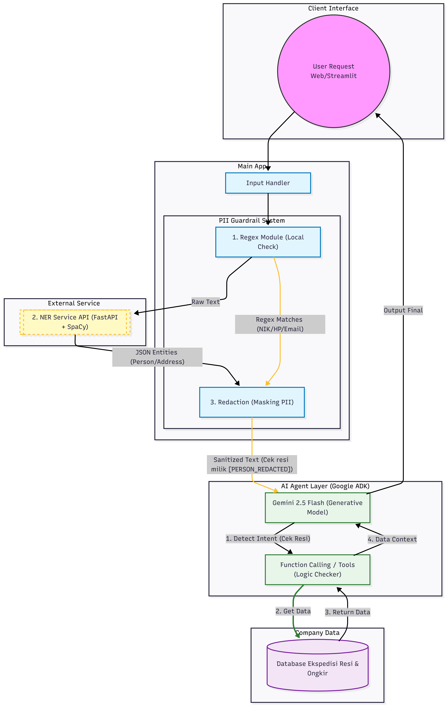

# Shipvue AI Support Agent with PII Guardrails 🛡️

Project ini adalah implementasi AI Agent untuk Customer Support yang dilengkapi dengan sistem proteksi data pribadi (PII Guardrail) menggunakan pendekatan Hybrid (Regex + Named Entity Recognition).

## 📋 Daftar Isi
- [Arsitektur Sistem](#-arsitektur-sistem)
- [Fitur Utama](#-fitur-utama)
- [Cara Menjalankan (Installation)](#-cara-menjalankan)
- [Logika Guardrail](#-logika-guardrail)
- [Laporan Performa](#-laporan-performa)
- [Deployment (GKE)](#-deployment-strategy)

## 🏗 Arsitektur Sistem

Sistem terdiri dari dua layanan mikro (Microservices) yang berjalan dalam container Docker:

1.  **Agent Service (Frontend & Logic):**
    * Framework: Streamlit & Python
    * Fungsi: Interface chat, manajemen state, dan orkestrasi LLM (Google Gemini).
    * Guardrail: Menggabungkan hasil Regex dan request ke NER Service.
2.  **NER Service (Backend AI):**
    * Framework: FastAPI & Spacy
    * Fungsi: Melayani request deteksi entitas (Nama, Lokasi, Organisasi) menggunakan custom model.



---

## Fitur Utama

* **Hybrid PII Detection:** Menggabungkan kecepatan **Regex** (untuk pola pasti seperti Email/Resi) dan kecerdasan **NER** (untuk Nama/Lokasi) untuk akurasi maksimal.
* **Real-time Redaction:** Data sensitif diubah menjadi token anonim (contoh: `[PERSON_REDACTED]`) sebelum dikirim ke pihak ketiga (LLM), menjaga privasi user.
* **Audit Logging:** Sidebar transparansi yang menampilkan data apa saja yang terdeteksi dan disensor oleh sistem.
* **Dockerized:** Siap dijalankan di lingkungan container dengan konfigurasi `docker-compose` yang lengkap.
* **Whitelist Logic:** Mencegah *False Positive* pada kata-kata umum (seperti "Shipvue", "Admin", "Min").

---

## Instalasi & Cara Menjalankan

Anda dapat menjalankan proyek ini menggunakan dua metode: **Docker (Direkomendasikan)** atau **Manual (Localhost)**.

### Prasyarat

* Git
* Docker & Docker Compose (Untuk metode Docker)
* Python 3.10+ (Untuk metode Manual)
* **API Key Google Gemini**

### 1. Persiapan Awal

Clone repository dan buat file konfigurasi environment:

```bash
git clone [https://github.com/tsanyzzu/shipvue-project.git](https://github.com/tsanyzzu/shipvue-project.git)
cd shipvue-project

# Buat file .env
echo "GOOGLE_API_KEY=masukkan_api_key_anda_disini" > .env

```

### 2. Metode A: Menggunakan Docker (Recommended)

```bash
# Build dan Jalankan Container
docker-compose up --build

```

* Tunggu hingga muncul pesan `Uvicorn running on http://0.0.0.0:8000`.
* Akses Chatbot: **http://localhost:8501**
* Akses API Doc: **http://localhost:8000/docs**

### 3. Metode B: Menjalankan Manual (Localhost)

Jika Anda ingin mengembangkan (develop) atau Docker bermasalah, gunakan cara ini. Anda perlu membuka **2 Terminal**.

**Terminal 1: Menyalakan NER Service**

```bash
# Buat & Aktifkan Virtual Environment (Opsional tapi disarankan)
python -m venv venv
# Windows: venv\Scripts\activate | Mac/Linux: source venv/bin/activate

# Install dependency NER
pip install -r services/ner_service/requirements.txt

# Jalankan Service
python services/ner_service/src/main.py

```

**Terminal 2: Menyalakan Agent Service**

```bash
# Pastikan venv aktif
# Install dependency Agent
pip install -r services/shipvue_agent/requirements.txt

# Jalankan Streamlit
streamlit run frontend/app.py

```

---

## Logika Guardrail 

Sistem menggunakan logika **Overlap Handling** cerdas untuk menggabungkan hasil Regex dan NER:

1. **Regex Scan:** Mendeteksi pola pasti (Email, URL, No HP, Format Resi `JP...`).
2. **NER Scan:** Mendeteksi entitas kontekstual (Person, GPE/Location, Org).
3. **Conflict Resolution:**
* Jika NER mendeteksi teks yang *sudah* ditandai oleh Regex, hasil NER diabaikan (Regex menang).
* Jika NER mendeteksi teks baru, hasil tersebut ditambahkan.


4. **Whitelisting:** Kata-kata seperti "Shipvue", "Admin", "Kak" dikecualikan dari sensor meskipun terdeteksi sebagai nama orang.

**Contoh Hasil:**

| Input User | Sanitized Output (ke LLM) |
| --- | --- |
| "Nama saya **Budi** di **Malang**." | "Nama saya **[PERSON_REDACTED]** di **[GPE_REDACTED]**." |
| "Cek resi **JP999** dong min." | "Cek resi **[RESI_ID_REDACTED]** dong min." |
| "Email saya **budi@gmail.com**" | "Email saya **[EMAIL_ADDRESS_REDACTED]**" |

---

## Laporan Performa

Berdasarkan pengujian internal menggunakan  `psutil`:

* **Average Latency (NER):** ~150 ms per request (CPU Only).
* **Memory Usage (NER Service):** ~300 MB.
* **CPU Usage:** Low footprint (< 10% on idle).

---

## Deployment Strategy (GKE)

Proyek ini telah dikonfigurasi untuk siap di-deploy ke **Google Kubernetes Engine (GKE)** untuk skalabilitas tinggi. Berikut adalah strategi deployment yang disiapkan:

1. **Containerization:**
* Image Docker dipisahkan menjadi `shipvue/ner-service` dan `shipvue/agent-service` untuk isolasi resource.
* Image di-push ke **Google Artifact Registry (GAR)**.


2. **Kubernetes Manifests:**\
pada folder k8s, nantinya akan diisi menggunakan file untuk konfigurasi Kubernetes. File tersebut berupa:
* **`ner-deployment.yaml`**: Menggunakan tipe `ClusterIP` karena hanya diakses secara internal oleh Agent.
* **`agent-deployment.yaml`**: Menggunakan tipe `LoadBalancer` untuk memberikan IP Publik kepada user.


3. **Service Communication:**
* Agent menghubungi NER menggunakan DNS Cluster internal: `http://ner-service:8000`, memastikan komunikasi yang aman dan cepat dalam jaringan cluster.


4. **Scaling:**
* NER Service dapat di-scale secara horizontal (menambah replica pod) menggunakan **Horizontal Pod Autoscaler (HPA)** berbasis penggunaan CPU jika trafik meningkat.


---

### 📂 Struktur Folder

```
shipvue-project/
├── docker/                 # Konfigurasi Dockerfile
├── k8s/                    # Konfigurasi Kubernetes 
├── frontend/               # Kode UI Streamlit
├── services/
│   ├── ner_service/        # Backend FastAPI + Model Spacy
│   └── shipvue_agent/      # Logic Agent + Guardrails
├── requirements.txt        # Dependency global
└── docker-compose.yml      # Orkestrasi lokal

```